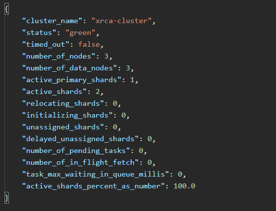

# Elasticsearch集群安装向导

**说明**：文档基于elasticsearch7（version 7.14.1）编写，版本差距较大时可能会产生差异。系统为centos7


# 0、环境说明

这里准备了三台同一网络下的centos7服务器，IP分别为 **192.168.0.201**、**192.168.0.202**、**192.168.0.203**。默认提前安装好了jdk（高版本的elasticsearch自带了jdk）。无特殊说明的情况下，下面的每一步都需要在三台服务器上执行。


# 1、安装前的准备

## 1.1、服务器基础环境配置

```
a、三台服务器时间同步
b、均已关闭防火墙或打开9200、9300端口，云服务器请配置好相关的安全组规则。
```


## 1.2、下载elasticsearch安装包

通过elasticsearch的官网地址https://www.elastic.co/cn/downloads/可以下载elastic公司的所有产品，提供了Linux、MacOS、Windows的安装包，同时可以选择历史版本下载。（如果elastic官网下载较慢可以找国内的镜像网站下载）


## 1.3、创建es用户

因为安全性问题，elasticsearch服务不允许使用root用户启动服务，这里我们需要创建一个普通用户，用来启动es服务。（使用root用户进行下面的操作）

```shell
#创建一个名为es的用户，并设置密码
sudo adduser es 
sudo passwd es

#赋予es用户root权限，方便后续的操作
# 添加sudoers文件的写权限
chmod u+w /etc/sudoers
#在root ALL=(ALL)ALL下面添加es的root权限
es ALL=(ALL) ALL
#撤销sudoers文件的写权限
chmod u-w /etc/sudoers
```

修改后的sudoers文件：


## 1.4、系统配置环境参数

主要提前设置一些系统环境参数（可以提前可以一下不设置，启动时可能会出现的问题：https://www.linuxidc.com/Linux/2019-08/159734.htm），可以对修改的文件先进行备份，防止修改错误。此处使用root用户进行。

> 1、设置文件句柄数
>
> ```shell
> #修改sysctl.conf文件
> vim /etc/sysctl.conf
> 
> #在文件中添加或修改为如下示例
> vm.max_map_count=655360
> 
> #刷新配置，使其生效
> sysctl -p
> 
> #再次查看
> 
> ```
>
> 
>
> 
>
> 2、设置用户最大线程数
>
> ```shell
> #修改limit.conf文件
> vim /etc/security/limits.conf
> 
> #在末尾添加/修改为下面设置，修改完重新退出就可以看到效果了（设置文件打开数、线程数、锁内存大小）
> * soft nofile 655350 
> * hard nofile 655350
> * soft nproc 32000
> * hard nproc 32000
> * hard memlock unlimited
> * soft memlock unlimited
> 
> #修改*-nproc.conf，不同版本的操作系统同前缀可能不一样
> vim /etc/security/limits.d/20-nproc.conf
> 
> #修改为如下配置
> soft nproc 2048
> 
> ```
>
> 


# 2、elasticsearch安装

下面开始正式进入elasticsearch的安装步骤：

## 2.1、上传包并解压安装

使用root用户，在/usr/local下创建了名为elk的文件夹，再在elk目录下创建elasticsearch目录，将上传的elasticsearch的包解压到**/usr/local/elk**目录下，此处使用root用户。

```shell
#解压elasticsearch包到制定目录，这里的包名根据实际情况进行修改
tar -zxvf elasticsearch-7.14.1-linux-x86_64.tar.gz -C /usr/local/elk

#将elk整个文件夹的权限赋给es用户
chown -R es /usr/local/elk

#配置elasticsearch的数据目录以及日志目录，可根据实际情况配置自己的目录，不一定要和下文一样
#数据目录
/usr/local/elk/elasticsearch/data
#日志目录
/var/log/elasticsearch

#将数据目录和日志目录的权限赋给es用户，不要忘记了
```


## 2.2、elasticsearch参数配置

切换到es用户，无特殊说明，接下来都是用es用户操作。进入到elasticsearch的目录下，可以看到目录结构如下：


> 这里介绍一下常用几个目录含义：
>
> bin：包含了elasticsearch的各种命令，常用的有elasticsearch、elasticsearch-plugin
>
> config：存放着elasticsearch的各类配置文件，主要用到的又elasticsearch.yml、jvm.options
>
> plugins：主要是存放插件包的目录，例如ik分词器


修改配置：

> 1、elasticsearch.yml
>
> 首先将elasticsearch.yml备份出来一份（每次安装服务时，最好养成备份初始文件的习惯，这样修改有问题时，可以回滚到最初的配置）。
>
> ```yaml
> #集群名称，同一集群节点名称应该一致
> cluster.name: saury-cluster
> 
> #集群节点名称，每个节点应该有自己的名称
> node.name: node1
> 
> #数据存放路径，上面已经设置过
> path.data: /usr/local/elk/elasticsearch/data
> 
> #日志存放路径，上面已经设置过
> path.logs: /var/log/elasticsearch
> 
> #es启动时，锁定内存，和环境配置中的所内存大小相关。此功能防止进行内存交换，影响es的效率
> bootstrap.memory_lock: true
> 
> #哪些host可以访问es，这边全部开放了，可根据实际安全情况设置
> network.host: 0.0.0.0
> 
> #RESTful端口
> http.port: 9200
> 
> #集群节点间通信端口
> transport.port: 9300
> 
> #集群节点一般是ip:port格式，port为transport.port
> discovery.seed_hosts: ["192.168.0.201:9300", "192.168.0.202:9300", "192.168.0.203:9300"]
> 
> #初始化master的节点，建议配置所有可成为节点的nodename
> cluster.initial_master_nodes: ["node1", "node2", "node3"]
> ```
>
> 除了上述配置之外，还有很多配置，可以网上自行查阅。附录中会给出具体的三个节点的配置供参考。
>
> 
>
> 2、jvm.options
>
> 这里主要是涉及到一些jvm的配置，可以根据实际需求，修改jvm内存大小，例如在较小内容的机器上需要降低jvm内存的使用额度。
>
> 

# 3、启动服务并测试

## 3.1、elasticsearch启动

进入到elasticsearch安装目录

```shell
#-d参数进行后台启动
./bin/elasticsearch -d
```


## 3.2、测试节点/集群状态

```http
#访问下面的地址，可以查询目前节点的集群状态，ip为集群中任意一个节点的地址，port为RESTful设置的端口
http://ip:port/_cat/nodes
```


如果能够看到全部的集群节点，则表明集群启动成功，带*表示为主节点，如果缺失节点，可以单独查看该节点的健康状况。

```http
http://ip:port/_cluster/health?pretty
```




## 3.3、常用排除方法

一般集群或节点启动失败有如下排除方法：

> 1、确定elasticsearch是否启动
>
> ```shell
> ps -ef|grep elasticsearch
> ```
>
> 
>
> 2、查看elasticsearch日志
>
> 进入到日志目录，查看名为{cluster_name}.log的日志，有些问题可能是因为系统环境原因。
>
> 
>
> 3、防火墙是否关闭或端口是否正常启动
>
> ```shell
> #查看防火墙是否关闭
> systemctl status firewalld
> 
> #查看当前打开的端口
> firewall-cmd --list-ports
> ```
>
> 
>
> 4、节点都正常，但是无法组成集群？**（大坑）**
>
> es各节点的数据如果不一致，会导致无法建立集群，可以删除所有节点data目录下的数据，重新启动尝试
>
> 


# 4、插件安装

## 4.1、ik分词器安装

elasticsearch的内置分词器对中文的分词支持不够，通常情况下我们需要安装较为常用的ik分词来使用。

> 安装插件的方法通常有两种：在线安装和离线安装
>
> 1、在线安装
>
> 在线安装需要良好的网络情况，由于很多时候涉及到内网的安装部署，又或者外网的访问速度较慢，通常我们不太推荐使用在线安装。
>
> ```shell
> ./bin/elasticsearch-plugin install https://github.com/medcl/elasticsearch-analysis-ik/releases/download/v6.3.0/elasticsearch-analysis-ik-6.3.0.zip
> ```
>
> 
>
> 2、离线安装
>
> 可以通过github来下载我们所需要的ik分词器**https://github.com/medcl/elasticsearch-analysis-ik**
>
> 
>
> 这里需要注意，下载ik分词器的版本必须与elasticsearch的版本相对应。
>
> 下载完成后，我们需要把插件解压到elasticsearch安装目录下的plugin目录
>
> 这里以ik安装好后的目录为例：
>
> 
>
> 安装完成后，需要重新启动es才能生效。
>
> 
>
> 测试插件是否安装成功：
>
> ```shell
> #运行elasticsearch安装目录下的bin目录中的plugin命令，可以查看当前安装了哪些插件
> ./bin/elasticsearch-plugin list
> ```
>
> 
>
> 


# 5、目前已知的可能会有的问题及解决方案

